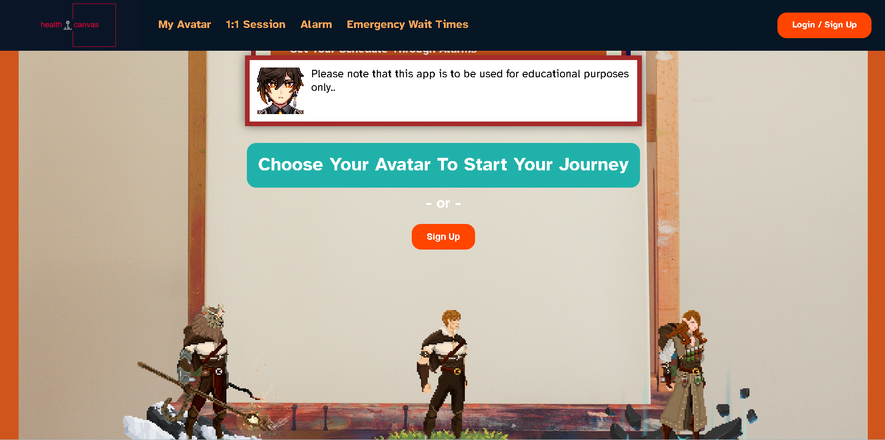

# Project Title

Health Canvas

## Project Screenshots

## Overview

Health Canvas is an app that analyzes the medical symptoms of users, and provides a differential diagnosis or offer likely explanations supported by the user data.
Initially the app will take into consideration two broad topics - cancer and cardiovascular disease.
Health Canvas will encourage and will assist with client-directed healthcare, where the user takes charge of their own health.

### Problem

In North America, and in many parts of the world, cardiovascular disease and cancer are the top two causes of mortality.
Early intervention, self-awareness of the symptoms, and engaging in preventative healthy lifestyles pays dividends in extending and increasing the quality of life.
Health Canvas aims to act as a place for users to log their symptoms over time, make diagnosis, and promote healthy choices in a fun and interactive way using fantasy themes.
Efforts will be made to suggest various ways of managing health, being mindful of the financial constraints which may act as a barrier for many people.

### User Profile

App built for the general public

- To lower the barrier to entry for using health services.
- To act as a bridge between the general public and health professionals.

### Features

Self-Health-Management Tool

- Ask About Your Medical Symptoms
- Log Your Symptoms And Results
- Set Your Schedule Through Alarms
- Emergency Department Information At Your Fingertips

## Implementation

FE: Single Page Application via React JS.
user will create a profile & avatar with some demographics info.
-Age, Sex, Ethnicity...
After profile creation, user is directed to avatar page, options to select on body system(s), add list of symptoms from drop down menu, and generate
a differential diagnosis based on list of symptoms and profile info.
Avatar will say something funny/inspirational/medical fact every 10 seconds when idle.

Q&A Page:
Greetings -> select from list of general symptoms -> screen for red flags -> if red flag(s) present -> strongly encourage user to get checkup/regular checkup if red flags(s) absent -> list common conditions up top, red-flag conditions bottom, and comment on their respective likelihood.

Prompt text "Hello user.name, How can I help you today?
List of Options:

- I have a headache
- I feel tired/fatigued
- I can't seem to focus
- My arm/leg feels weak
- I feel dizzy
  etc

eg. Select "I have a headache" -> headaches could be a sign of number of things... -> Are you experiencing / do you have... -> since you have answered "red flag", we Strongly Encourage you to get a medical review or schedule for a regular check up if overdue.

### Tech Stack

Front End

- React / HTML / CSS

Back End

- Node.js & Express
- JWT (WIP)

Database

- MySQL & SQL (WIP)

Libraries

- Knex.js
- Axios
- JSDOM

### APIs

Chat GPT integration(If funds are available)

Self-Hosted RESTful API

### Sitemap

1. Landing Page
2. HomePage: Creation of user profile, input user demographics handled via form
3. AvatarPage(CharacterPage): Select body systems, select various symptoms (general or system specific symptoms), and receive a list of differentials.
4. Q&A Page: Select from a pre-selected list of general, common symptoms, eg. Why do I have headaches? and offer up potential list of reasons.

### Endpoints

List endpoints that your server will implement, including HTTP methods, parameters, and example responses.

### Auth

Since the app will be keeping track of individual profiles and the associated data, it would be ideal to have Auth as part of the app.
However, due to the potential difficulty of its implementation, this will be lower on the list, or potentially under nice-to-haves.
authentication/authorization will be done using the jwt library, passing user info along with the jwt tokens to authorize.
JWT secret key will be in .env on the server side.

## Roadmap / Future Updates

Implementation of location services for Emergency Wait Times page.
Server: Setting up Server as RESTful API, Setting up seeding and migrations for testing.
MySQL: Setting up DBs, creation of tables, and relationships to retrieve appropriate data.
